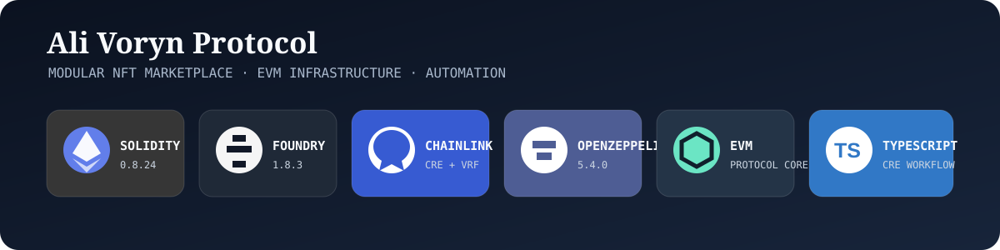
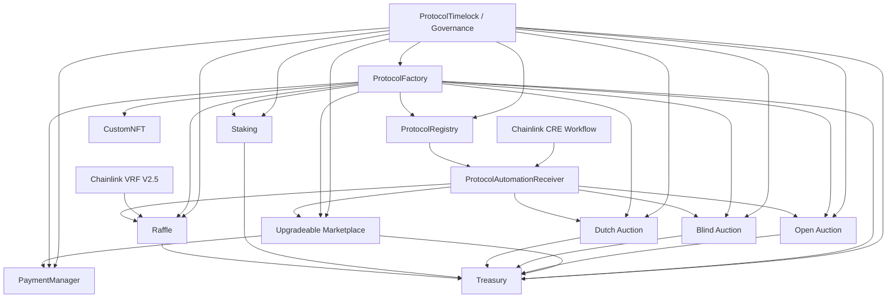

<div align="center">

# Ali Voryn Protocol

**A modular Solidity / EVM protocol for NFT markets, auctions, staking, raffles, treasury accounting, governance, and Chainlink-powered automation.**

<picture>
     
</picture>

<br />

<p>
     
     
     
     
</p>

`Marketplace` · `Auctions` · `Raffles` · `Staking` · `Governance` · `Automation`

</div>

## Overview

Ali Voryn Protocol is a production-oriented Solidity/EVM reference implementation designed as a modular
protocol suite, not a single-purpose contract. The domains are independently deployable and share three
things: a registry for discovery, a treasury/payment layer for accounting, and a factory for deployment.

The codebase brings together:

- NFT issuance with ERC-721 behaviour
- Primary marketplace listings and offers, including EIP-712 signed orders
- Open, blind commit-reveal, and Dutch auctions
- Treasury and payment accounting with explicit liability tracking
- Staking and scheduled reward distribution
- Chainlink VRF V2.5-backed raffles
- Factory-based protocol composition with deterministic deployment paths
- Registry and Timelock governance primitives
- Upgradeable marketplace infrastructure
- Chainlink CRE automation with bounded discovery and a fail-closed receiver
- Layered verification: unit, integration, fuzz, stateful invariants, security, fork, regression, upgrade,
  conformance, deployment, mutation, and symbolic
- Reproducible deployment and post-deployment verification workflows

> **Security status.** This repository is a production-oriented engineering reference implementation. It is
> not presented as an independently audited mainnet release. External security review, target-chain
> integration validation, operational review, and staged deployment remain release gates. See
> [`SECURITY.md`](SECURITY.md) and [`docs/security.md`](docs/security.md).

## Architecture



The architecture intentionally separates protocol domains, shared accounting, deployment/registration,
governance, and external automation. Core contracts do not need to know about the CRE workflow layer:
automation discovers eligible work through bounded on-chain views and submits validated reports through the
receiver. Full detail is in [`docs/architecture.md`](docs/architecture.md).

## Core Features

### 🛒 Marketplace — `src/core/Marketplace.sol`

- Listings with creation, update, cancellation, batch cancellation, and expiry flows
- Direct purchases with exact-payment and escrow-aware settlement
- Offers with accept, reject, cancel, and expiry paths, refunded through the PaymentManager
- Signed listing execution using EIP-712 typed data, with per-seller nonces for replay protection
- Protocol fee, minimum fee floor, and account-specific fee overrides
- Treasury and PaymentManager integration with both dependencies re-validated on every change
- UUPS upgradeability with role-gated authorisation
- Pausing and operator controls separated from administrative configuration
- Bounded automation discovery for expiring offers

### 🔨 Open Auction — `src/core/OpenAuction.sol`

- Reserve prices and minimum bid increments
- Scheduled starts with automatic activation on first interaction
- Bid history snapshots and optional buyout
- Anti-sniping extension: 5-minute window, 5-minute extension, up to 3 times
- Seller/owner cancellation with full refund accounting
- Pull-based refunds
- Escrow solvency invariant enforced at runtime
- Automation discovery for auctions requiring lifecycle finalisation

### 🕵️ Blind Auction — `src/core/BlindAuction.sol`

- Commit-reveal bidding with `keccak256(abi.encodePacked(value, fake, secret))`
- One-time commitment enforcement, removing commitment replay and front-running
- Reveal extensions (5 minutes, up to 3 times) on valid late reveals
- Unrevealed-deposit accounting and pending-return accounting
- Seller proceeds and fee settlement with escrow verification before NFT release
- Cancellation recovery path
- Explicit phase model derived from the clock, plus automation readiness
- Escrow invariant tracking

### 📉 Dutch Auction — `src/core/DutchAuction.sol`

- Time-decaying price model using exact `Math.mulDiv` interpolation
- Purchases at or above the current price, with inline excess refund to the buyer
- Current-price calculation clamped at both schedule boundaries
- Explicit cancellation and expiry flows
- Automation discovery for expired auctions

### 🎟️ Raffle — `src/core/Raffle.sol` + Chainlink VRF V2.5

- Ticket purchasing with entrant span accounting and per-wallet caps
- Chainlink VRF V2.5 random-winner flow with request binding
- Native or LINK payment configuration
- Callback validation before any state transition
- Retry path for stuck randomness requests (owner-only, deliberately not automated)
- Controlled stuck-raffle cancellation after a 24-hour delay
- Cursor-based batched refund processing
- Failed-raffle finalisation and pull-based refund claims
- Bounded automation candidate discovery
- Fork coverage for the external VRF integration

### 🪙 Staking — `src/core/Staking.sol`

- Reward funding from the contract or from the Treasury
- Scheduled reward programs with exact divisibility requirements
- Time-bounded reward phases
- Stake / unstake flows with explicit accounting boundaries
- Claimable rewards, reward compounding, and cooldown handling
- Emergency unstake with a configurable penalty that remains in the reward inventory
- Configurable minimum/maximum stake bounds
- Reward inventory tracking that can never be paid out if unsupported
- Stateful reward and accounting invariants

### 🖼️ Custom NFT — `src/core/CustomNFT.sol`

- Self-contained ERC-721 implementation with ERC-721 Metadata support
- Single and batch minting (up to 100 per call)
- Wallet mint limits, supply caps, and time-windowed mint phases
- Burn support with enumeration cleanup
- Token URI and base URI management under a dedicated role
- Role-based minting, metadata, and operator administration
- Safe transfer handling through `IERC721Receiver`
- ERC-165 / ERC-721 / ERC-721 Metadata conformance
- Pause controls and operator authorisation

### 🏦 Treasury — `src/core/Treasury.sol`

- Authorized payer model
- Claimable balances with pull-based withdrawal
- Fee-recipient accounting
- Spending windows with daily limits and remaining-allowance tracking
- Protocol liabilities and available-balance accounting
- Emergency rescue bounded by unencumbered funds
- `pay()` can never spend user liabilities

### 💳 Payment Manager — `src/core/PaymentManager.sol`

- Authorized creditor model for buyer-side refunds
- Credit accounting by reason
- Claimable balances with pull-based withdrawal
- Factory-controller lifecycle, finalisable to `address(0)`
- Direct payments rejected, so every wei is attributed to a named account

### 🏭 Protocol Factory — `src/factory/ProtocolFactory.sol`

- Modular deployment of the protocol suite
- Six dedicated deployer libraries keeping the Factory runtime under EIP-170
- Protocol-wide creation flow with complete payer/creditor wiring
- Custom NFT deployment plus CREATE2 deterministic address prediction
- Auction, staking, raffle, marketplace, treasury, and payment-manager instantiation
- Registry registration and per-creator instance indexing
- Ownership handoff as a two-step transfer
- Treasury-authority checks around dependent deployments
- Irreversible controller finalisation

### 📚 Registry — `src/registries/ProtocolRegistry.sol`

- Instance registration with validation (code presence, creator, implementation, version, uniqueness)
- Registrar authorization
- Active/inactive lifecycle that automation respects
- Global, per-kind, and per-creator indexing
- Automation-specific discovery with cycle-aware bounded enumeration

### 🏛️ Governance — `src/governance/ProtocolGovernance.sol`

- OpenZeppelin `TimelockController` based protocol control plane
- Two-step ownership handoff patterns across critical contracts
- Governance-aware factory finalisation
- Explicit separation between bootstrap authority and long-term protocol authority
- Scripts for scheduling and executing Timelock ownership acceptance

## Chainlink CRE Automation

The automation layer is a separate execution boundary around the protocol.

```text
Cron Trigger
     ↓
CRE Workflow
     ↓
Bounded On-chain Discovery
     ↓
Validated Action Report
     ↓
KeystoneForwarder
     ↓
ProtocolAutomationReceiver
     ↓
Protocol Domain Function
```

| Domain | Automated action |
| --- | --- |
| Open Auction | `finalizeAuction(uint256)` |
| Blind Auction | `finalizeAuction()` |
| Dutch Auction | `expireAuction(uint256)` |
| Marketplace | `expireOffer(uint256)` |
| Raffle | `requestRandomWinner(uint256)` |
| Raffle | `processRaffleRefunds(uint256,uint256)` |
| Raffle | `finalizeFailedRaffle(uint256)` |

The receiver is intentionally fail-closed: it starts paused, and it adds explicit action allowlisting,
workflow identity validation, target-kind validation, replay/staleness protection, refund-cursor
protection, and schedule/value validation. There is no arbitrary `target.call(data)`.

Discovery is bounded rather than an unbounded per-ID scan: each domain view takes
`(cycle, maxScan, maxItems)` with an on-chain hard cap of 500 inspected ids and 100 returned items. The
default configuration selects one instance per kind per execution, costing **11 EVM reads** against a
15-read quota, with a `gasLimit` of 1,000,000 and a refund batch size of 12 backed by a measured gas test.

- Official Chainlink CRE documentation: <https://docs.chain.link/cre>
- Repository automation documentation: [`docs/AUTOMATION.md`](docs/AUTOMATION.md)
- Workflow internals: [`cre/protocol-automation/README.md`](cre/protocol-automation/README.md)

## Verification Strategy

Verification is intentionally layered. A test exists to specify a behaviour or a property — not merely to
increase coverage. The philosophy and the rules are in [`docs/test-strategy.md`](docs/test-strategy.md).

| Layer | Purpose |
| --- | --- |
| Unit | Deterministic contract behaviour, boundaries, reverts, events |
| Integration | Multi-contract protocol flows |
| Fuzz | Input-space exploration and edge cases |
| Invariant | Stateful protocol properties and accounting conservation |
| Security | Access control, replay, reentrancy, lifecycle, and failure paths |
| Regression | Previously identified failures remain fixed |
| Fork | Live external protocol behaviour and target-chain assumptions |
| Upgrade | Upgradeability and implementation transitions |
| Conformance | ERC/interface behaviour |
| Deployment | Wiring and deployed-system assumptions |

**Current scale:** 84 `*.t.sol` files, 110 test contracts, 638 test functions, and 14 invariant functions —
**652 combined verification entry points**. Per-suite detail is in
[`docs/test-matrix.md`](docs/test-matrix.md).

Meta-level verification:

```text
verification/
├── mutation/
│   ├── gambit.json
│   └── run.sh
└── symbolic/
    ├── AuctionMathHarness.sol
    ├── FeeMathHarness.sol
    ├── RewardMathHarness.sol
    └── run.sh
```

Mutation testing evaluates whether tests detect controlled source changes. Symbolic harnesses target
high-value arithmetic and monotonicity properties through Solidity's SMT tooling. Neither layer replaces
behavioural, fuzz, invariant, integration, fork, deployment, or security testing.

## Repository Structure

```text
.
├── .github/
│   └── dependabot.yml             # Dependency update visibility (Actions + CRE npm)
├── assets/                        # Repository banner and brand assets
├── cre/
│   └── protocol-automation/       # Chainlink CRE TypeScript workflow
├── docs/                          # Documentation set — start at docs/README.md
├── lib/                           # Pinned dependencies (vendored; @chainlink/ -> lib/chainlink-evm)
├── script/                        # 15 deployment, governance, VRF, automation, verification scripts
├── src/
│   ├── automation/                # Automation receiver boundary
│   ├── automation/chainlink/      # Vendored Chainlink ReceiverTemplate + IReceiver
│   ├── core/                      # Marketplace, auctions, raffle, staking, treasury, NFT, ledgers
│   ├── factory/                   # Protocol factory
│   ├── factory/deployers/         # Six external deployer libraries
│   ├── governance/                # Timelock governance primitive
│   ├── interfaces/                # 11 protocol interfaces
│   ├── libraries/                 # 10 shared math, phase, fee, hash, and scan libraries
│   └── registries/                # Protocol registry
├── test/                          # Domain-first verification tree
│   ├── auctions/                  # blind, dutch, open
│   ├── automation/                # Receiver, discovery, validation, gas, scripts
│   ├── factory/
│   ├── governance/
│   ├── libraries/                 # One suite per library
│   ├── marketplace/               # Includes Marketplace.SignedOrders and Marketplace.Upgrade
│   ├── nft/
│   ├── payment/
│   ├── protocol/                  # System-level deployment + integration
│   ├── raffle/                    # Includes the only Fork suite
│   ├── registry/
│   ├── staking/
│   ├── support/                   # TestBase, AutomationIntegrationBase, mocks
│   └── treasury/
├── verification/                  # Mutation + symbolic verification layers
├── foundry.toml                   # Foundry configuration and profiles
├── remappings.txt                 # Dependency import mapping
├── Makefile                       # Reproducible developer commands
├── SECURITY.md                    # Security reporting policy
└── LICENSE                        # MIT
```

## Toolchain & Dependency Pins

The project uses explicit versions to make builds reproducible.

**Solidity / Foundry**

| Component | Version |
| --- | --- |
| Solidity | `0.8.24` |
| Foundry baseline | `1.8.3` |
| forge-std | `v1.16.2` |
| OpenZeppelin Contracts | `v5.4.0` |
| OpenZeppelin Contracts Upgradeable | `v5.4.0` |
| Chainlink EVM | `contracts-v1.5.0` |

**Chainlink CRE workspace** (`cre/protocol-automation/`)

| Component | Version |
| --- | --- |
| Node.js | `>=22.6.0` |
| `@chainlink/cre-sdk` | `1.22.0` |
| `viem` | `2.56.8` |
| `zod` | `3.25.76` |
| TypeScript | `5.9.2` |

`script/install-dependencies.sh` installs the pinned Foundry dependencies and verifies that the four
critical imports resolve. Dependency installation is reproducible rather than tracking moving development
branches.

## Getting Started

**Requirements:** Foundry v1.8.3, Node.js >= 22.6.0 (CRE workspace), Git, and a configured RPC endpoint for
fork and deployment workflows.

```bash
cp .env.example .env
make setup
```

```bash
# Format, build, test
make fmt-check
make build
make test
```

```bash
# Deeper verification
make lint
make fuzz
make invariant
make coverage
make snapshot
```

```bash
# Fork tests (requires RPC_URL)
make fork
```

```bash
# Preflight and post-deployment verification (read-only, require RPC_URL)
make preflight
make verify-deployment
```

```bash
# CRE workflow
cd cre/protocol-automation
npm ci
npm test
npm run typecheck
```

These commands require an explicit and reviewed `RPC_URL` plus the environment expected by the deployment
scripts. **Do not broadcast transactions from an unreviewed environment.** The full command reference and
troubleshooting guide is in [`docs/local-development.md`](docs/local-development.md).

## Deployment Model

Deployment is split by responsibility rather than hidden inside one script.

```text
Protocol deployment
        ↓
Registry / protocol registration
        ↓
Governance deployment
        ↓
VRF subscription setup
        ↓
Ownership transfer scheduling
        ↓
Timelock ownership acceptance
        ↓
Factory-controller finalization
        ↓
Deployment verification
        ↓
Post-deployment smoke tests
```

Script responsibilities include protocol deployment, governance deployment, VRF subscription creation and
funding, VRF consumer registration, automation receiver deployment and configuration, ownership transfer
and Timelock acceptance, protocol finalisation, preflight checks, and deployment verification.

The mainnet operational procedure is documented in [`docs/mainnet.md`](docs/mainnet.md) and
[`docs/raffle-mainnet.md`](docs/raffle-mainnet.md); the script and environment-variable reference is in
[`docs/deployment.md`](docs/deployment.md).

## Engineering Decisions

**Domain-first tests.** Tests are organised around the system or protocol boundary under verification.
Methodology appears in the filename (`.Unit.t.sol`, `.Fuzz.t.sol`, `.Invariant.t.sol`, …) rather than
becoming the primary directory hierarchy.

**Invariants as protocol properties.** Escrow solvency, accounting conservation, registry consistency,
creator/index consistency, and state-machine correctness are checked across mutable state. The same
relations are asserted at runtime by the contracts, so a broken state reverts rather than persisting.

**Bounded automation discovery.** Automation discovery surfaces explicitly cap both the scan window and the
number of returned actions, allowing off-chain workflows to reason about gas and RPC budgets without
iterating unbounded protocol state.

**Governance as an actual control plane.** The Timelock is treated as a control plane only where
ownership and roles actually point at it. The deployment runbook therefore includes explicit ownership
acceptance and factory-controller finalisation instead of assuming that a deployed Timelock automatically
controls the protocol.

**Deployer libraries.** Contract creation lives in six external libraries called by the Factory via
`delegatecall`. Because the call runs in the Factory's context, deployment semantics — creator, deployer
address, resulting addresses — are unchanged; only bytecode storage moved.

## Security Notes

The repository includes a dedicated security policy in [`SECURITY.md`](SECURITY.md), a trust-boundary and
limitations document in [`docs/security.md`](docs/security.md), and a lint-finding inventory in
[`docs/LINTING.md`](docs/LINTING.md).

Do not commit:

- `.env` files
- private keys
- RPC credentials
- API keys
- production secrets

The repository also distinguishes between:

```text
Passing tests
     ≠
External security audit
     ≠
Target-chain integration verification
     ≠
Operational readiness
```

Before a real mainnet broadcast, the documented release process requires clean-checkout verification,
exact dependency installation, build/size gates, tests, fuzzing and invariants, static analysis, mutation
and symbolic checks, target-chain fork validation where applicable, source verification, governance
handoff verification, VRF consumer registration, and post-deployment smoke tests.

### Known Release Considerations

The documentation explicitly calls out operational boundaries that should be resolved before a production
deployment. Each is documented with its consequence and the decision it requires in
[`docs/security.md`](docs/security.md#known-design-limitations):

- After `finalizeProtocolSuiteControllers`, the Factory can no longer authorize new Treasury payers, so the
  per-NFT `createBlindAuctionInstance` flow needs a reviewed authorization strategy for a finalized
  protocol Treasury.
- Marketplace offer refunds through `cancelOffer` / `expireOffer` are blocked while the Marketplace is
  paused, which freezes buyer escrow for the duration.
- Pausing a `CustomNFT` collection also freezes transfers, so a paused collection cannot settle auctions,
  raffles, or listings that escrow its tokens.
- The tree needs one `forge fmt` pass before a strict formatting gate can be considered clean.
- A passing local test suite does not substitute for independent review of live Chainlink configuration,
  target-chain addresses, or production operations.

## Documentation Map

The documentation set lives in [`docs/`](docs/) — start at [`docs/README.md`](docs/README.md), which
contains reading paths for engineers, auditors, operators, and integrators.

| Document | Purpose |
| --- | --- |
| [`docs/architecture.md`](docs/architecture.md) | System boundaries, module map, authority model, data flow |
| [`docs/features.md`](docs/features.md) | Complete feature catalogue with the contract that owns each behaviour |
| [`docs/contracts.md`](docs/contracts.md) | Contract-by-contract reference: state, API, roles, events, invariants |
| [`docs/local-development.md`](docs/local-development.md) | Toolchain, setup, profiles, commands, troubleshooting |
| [`docs/test-strategy.md`](docs/test-strategy.md) | Verification philosophy and what each layer may claim |
| [`docs/test-matrix.md`](docs/test-matrix.md) | Every suite in `test/`, domain by domain |
| [`docs/coverage-baseline.md`](docs/coverage-baseline.md) | Recorded coverage numbers and interpretation rules |
| [`docs/security.md`](docs/security.md) | Trust boundaries, adversarial model, accounting invariants, limitations |
| [`docs/deployment.md`](docs/deployment.md) | Deployment sequence, script reference, environment variables |
| [`docs/preflight.md`](docs/preflight.md) | The pre-broadcast gate and its failure playbook |
| [`docs/mainnet.md`](docs/mainnet.md) | Mainnet release runbook including governance handoff |
| [`docs/raffle-mainnet.md`](docs/raffle-mainnet.md) | Chainlink VRF operational reference |
| [`docs/AUTOMATION.md`](docs/AUTOMATION.md) | Automation boundary, discovery model, gas budget, sequencing |
| [`docs/LINTING.md`](docs/LINTING.md) | Lint scope, exclusions, and finding adjudication status |
| [`docs/glossary.md`](docs/glossary.md) | Definitions of the domain terms used across the codebase |
| [`test/README.md`](test/README.md) | How the test tree is organised |
| [`verification/README.md`](verification/README.md) | Mutation and symbolic verification layers |
| [`cre/protocol-automation/README.md`](cre/protocol-automation/README.md) | CRE workflow architecture and deployment sequence |
| [`SECURITY.md`](SECURITY.md) | Security reporting policy |

## Official Technology References

- Solidity — <https://docs.soliditylang.org/>
- Foundry — <https://getfoundry.sh/>
- Chainlink — <https://docs.chain.link/>
- Chainlink CRE — <https://docs.chain.link/cre>
- OpenZeppelin Contracts — <https://docs.openzeppelin.com/contracts/5.x/>
- GitHub README guidance — <https://docs.github.com/en/repositories/managing-your-repositorys-settings-and-features/customizing-your-repository/about-readmes>

## License

This project is released under the MIT License. See [`LICENSE`](LICENSE) for details.

<div align="center">

**Ali Voryn**

*Beyond Every Defined Horizon.*

Built to explore where protocol architecture, verification, and automation meet.

</div>
